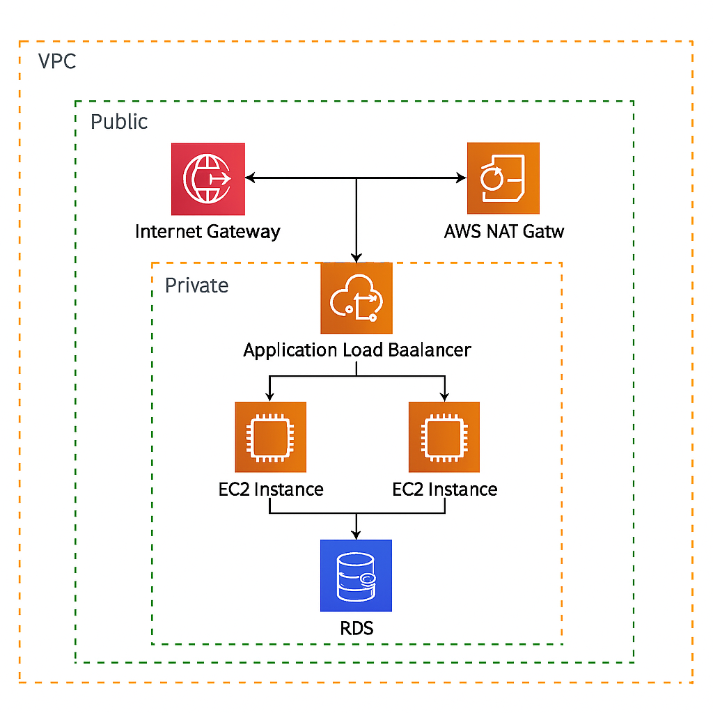

# Business Automation System (3-tier architecture)

This project deploys a production-style three-tier architecture on AWS using Terraform. It simulates a real-world infrastructure setup used to host scalable and secure web applications, internal tools, or customer-facing services. The setup emphasizes modularity, automation, and AWS best practices.

## Architecture Overview
- VPC with public and private subnets across multiple AZs
- Internet Gateway for public access to load balancer
- NAT Gateway for secure outbound traffic from private subnets
- Application Load Balancer (ALB) routing HTTP/S traffic to EC2 instances
- EC2 instances hosted in private subnets behind the ALB
- IAM roles and security groups enforcing least-privilege access
- Optional: Extendable to include RDS or DynamoDB for persistence

## Architecture Diagram

This diagram visualizes the separation of web, application, and database layers in a secure networking layout.

If the image doesn't render, [click here to view it directly](three-tier-architecture.png).

## Tools Used
- Terraform (v1.5+) – Infrastructure as Code
- AWS VPC – Networking and subnet isolation
- EC2 – Application servers
- Application Load Balancer – Distributes traffic across EC2 targets
- IAM – Secure access control and identity management
- NAT Gateway / Internet Gateway – Internet access for the appropriate layers

## Use Case
This infrastructure can host a web application (Node.js, Python, etc.), serve internal APIs behind a load balancer, or act as a foundation for multi-tier enterprise systems.

## How to Deploy

Ensure you have Terraform installed and your AWS credentials configured.

Region used: us-east-1 (you can change this in the provider block)

git clone https://github.com/sjlewis25/Three-Tier-AWS-Architecture.git  
cd Three-Tier-AWS-Architecture  
terraform init  
terraform plan  
terraform apply  

To destroy the infrastructure:

terraform destroy

## Outputs
After deployment, Terraform will display:
- ALB DNS name for web access
- Subnet IDs
- EC2 instance private IPs

## Module Breakdown
- vpc/ – Creates VPC, public/private subnets, route tables, gateways
- alb/ – Provisions Application Load Balancer, listeners, and target groups
- ec2/ – Launches EC2 instances in private subnets and associates them with the ALB
- nat/ – Creates a NAT Gateway and routes for outbound internet access

## Lessons Learned
- Created fully modular and reusable Terraform components
- Practiced IAM role and policy management for secure deployments
- Gained experience automating high-availability, multi-tier environments
- Confidently provisioned and destroyed AWS environments without using the console

## File Structure
├── main.tf  
├── variables.tf  
├── outputs.tf  
├── modules/  
│   ├── vpc/  
│   ├── ec2/  
│   ├── alb/  
│   └── nat/  
├── three-tier-architecture.png

## Cost Reminder
This infrastructure includes billable AWS resources (ALB, EC2, NAT Gateway). Tear down when done to avoid unnecessary charges.

## License
MIT License. Use or adapt for your own projects.

## Contact
Built by Steve Lewis  
GitHub: https://github.com/sjlewis25  

